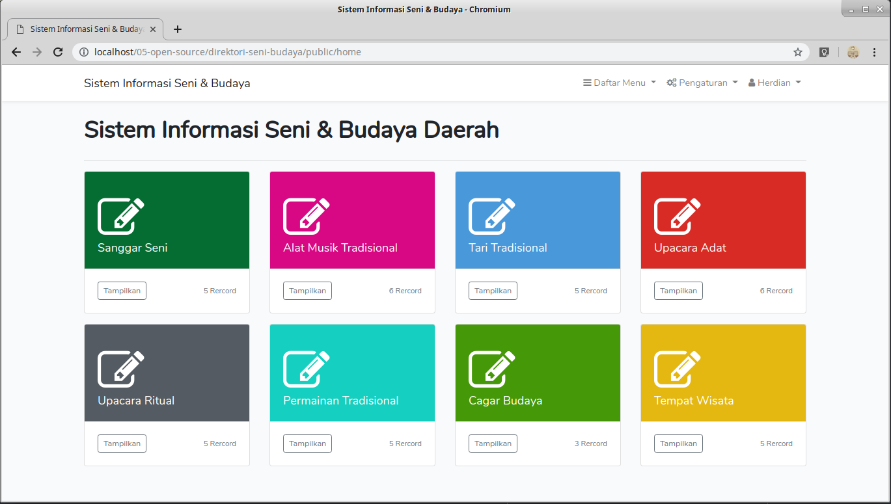
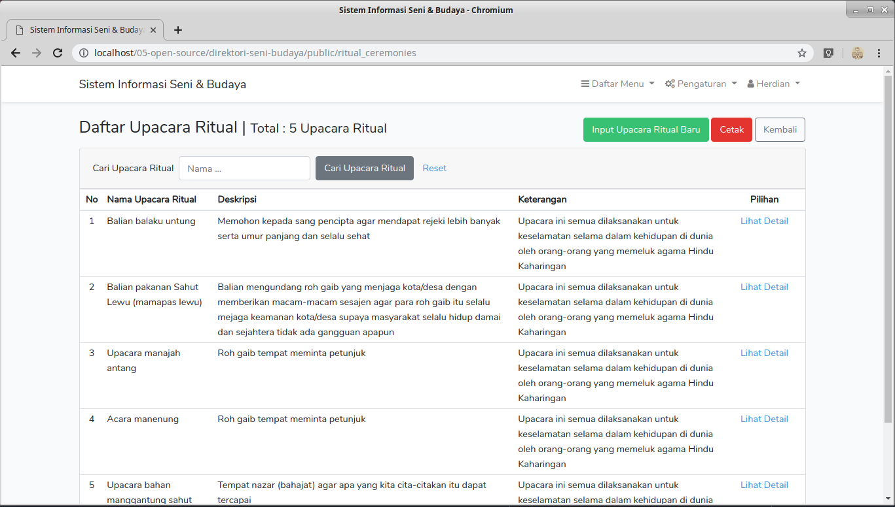
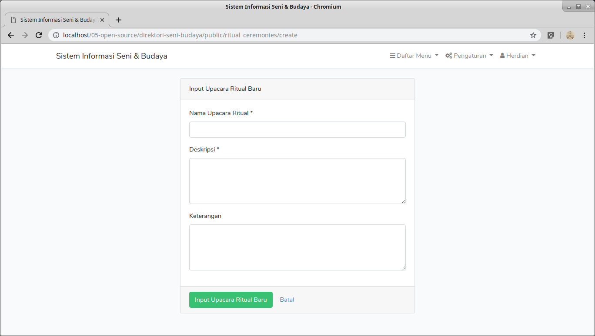
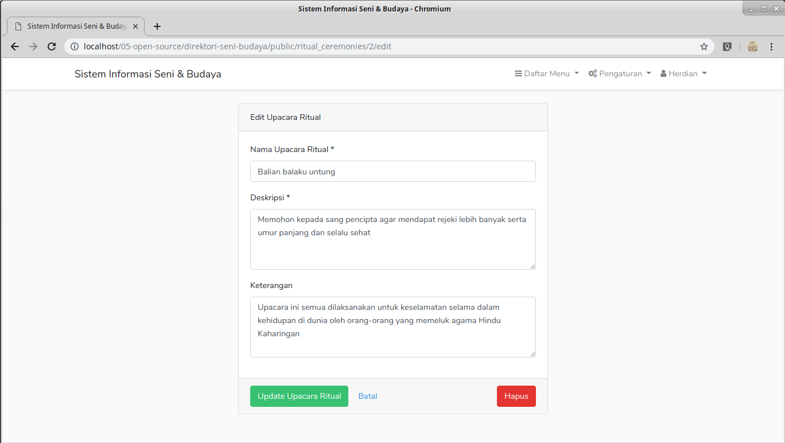
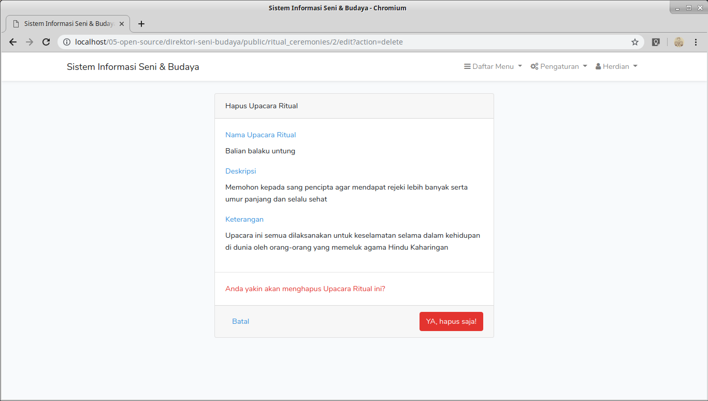
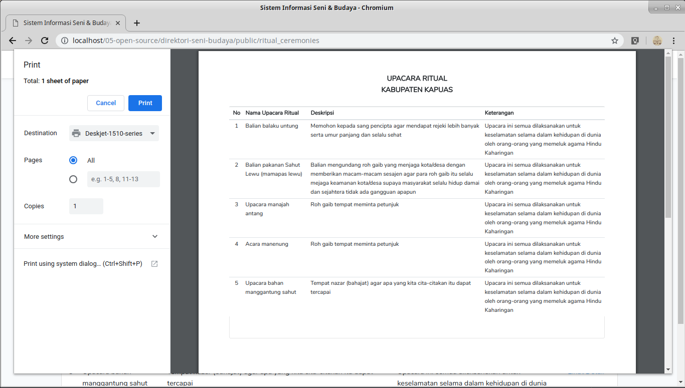
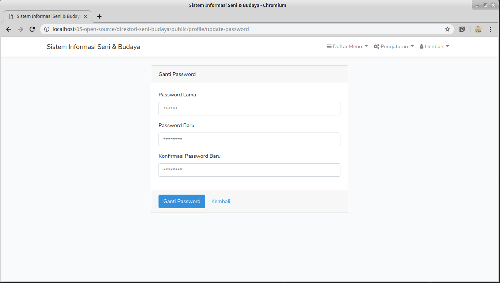
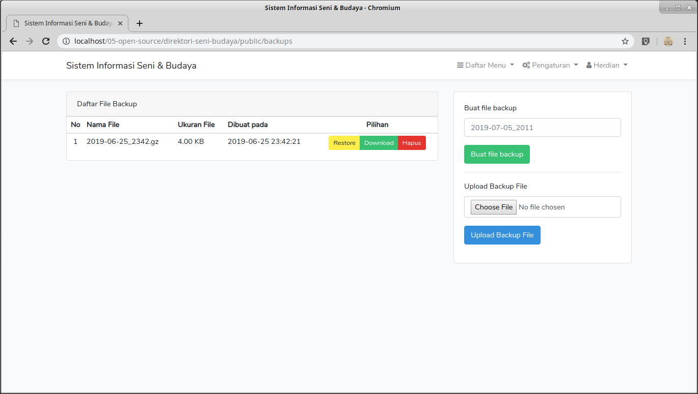
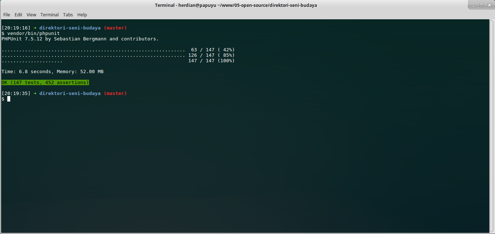

<h1 align="center">Sistem Informasi Seni dan Budaya</h1>

## Tentang
Sistem Informasi Seni dan Budaya adalah aplikasi berbasis web sederhana untuk menyimpan data seni dan budaya daerah.

## Fitur
Fitur yang tersedia di aplikasi ini adalah sebagai berikut
1. Kelola data Sanggar Seni
2. Kelola data Alat Musik Tradisional
3. Kelola data Tari Tradisional
4. Kelola data Upacara Adat
5. Kelola data Upacara Ritual
6. Kelola data Permainan Tradisional
7. Kelola data Cagar Budaya
8. Kelola Data Tempat Wisata
9. Kelola Data Kecamatan
10. Perbarui user password
11. Backup dan Restore Database
12. Print list data
13. Flash message perubahan data

## Cara Install

### Persyaratan
Aplikasi ini dapat diinstal pada local dan online server dengan spesifikasi
1. PHP 7.2 (Laravel 5.8)
2. Database MySQL atau MariaDB
3. Database SQLite (untuk automated testing)

### Langkah Instalasi
Langkah untuk menginstal aplikasi
1. Clone repo dengan perintah : `git clone https://github.com/orcome/direktori-seni-budaya.git`
2. `cd direktori-seni-budaya`
3. `composer install`
4. `cp .env.example .env`
5. `php artisan key:generate`
6. Buat database baru di MySQL
7. Set database yang digunakan pada file `.env`
8. `php artisan migrate`
9. `php artisan serve`
10. Selesai (register user baru untuk menggunakan aplikasi)

## Testing
Aplikasi ini dibangun menggunakan testing (TDD) menggunakan SQLite database
`vendor/bin/phpunit`

## Screenshots
Berikut adalah beberapa tampilan aplikasi
#### Dashboard

#### List

#### Input

#### Edit

#### Delete

#### Layout Print

#### Change Password

#### Backup and Restore Database

#### Testing

## License
Sistem Informasi Seni dan Budaya adalah software open-source dengan license [MIT license](LICENSE).

